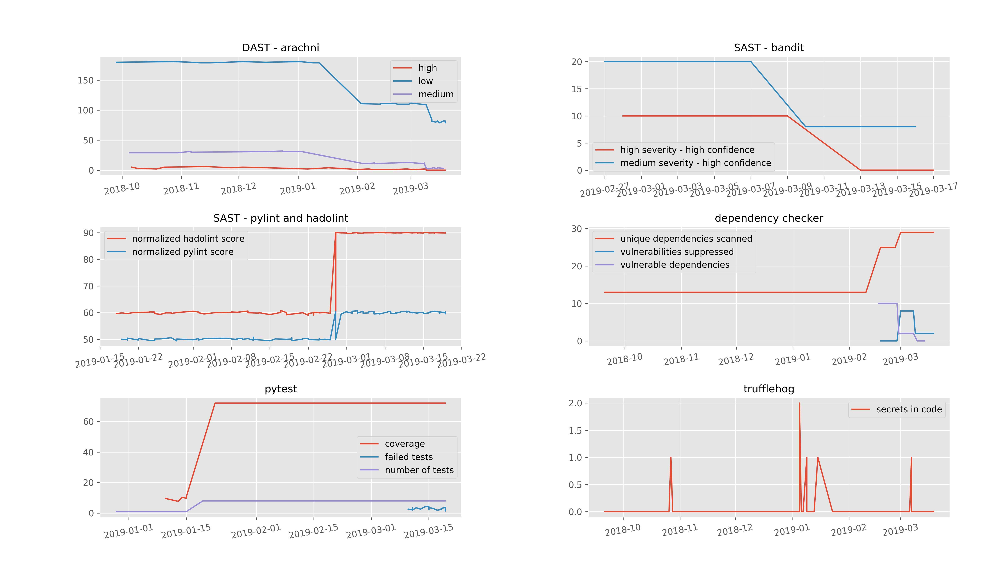

# Emergency Data Timeseries charts

#### Started with "Light timeseries charts"  
Original by Fabio Arciniegas  
Original at: https://github.com/fabioarciniegas/light_timeseries_charts/tree/master  

## Assembled for quick aggregation of Lincoln County, Nebraska Emergency Service Response Data

Plot diagrams using arbitrary time series data of the form:

``` csv
"incident_date","response_unit","dispatch_time","time_in_service"
"01/01/10","M5","07:05:17","00:04:56"
"01/01/10","WAVE1","06:51:33","00:20:10"
"01/01/10","WAVE12","06:51:33","01:26:48"
"01/01/10","GRE310","07:56:42","00:06:56"
"01/01/10","WAVE1","07:56:42","00:11:42"
"01/01/10","WAVE11","08:05:59","00:59:47"
"01/01/10","MWM31","09:51:58","02:08:33"
"01/01/10","PLEA1","09:51:58","00:40:12"
"01/01/10","PLEA2","09:51:58","00:40:17"
"01/01/10","SE1","15:48:32","00:20:35"
"01/01/10","SE11","15:48:32","00:20:06"
"01/01/10","SE12","15:58:26","00:33:07"
"01/01/10","B1","20:22:57","00:00:05"
"01/02/10","8707","02:02:55","02:48:52"
"01/02/10","CERE1","01:41:51","02:58:42"
"01/02/10","RAYM1","01:46:16","01:52:36"
"01/02/10","WAVE1","01:46:16","01:07:18"
"01/02/10","SW1","16:33:09","00:26:58"

```

This was assembled to consolidate some of the Lincoln County, Nebraska emergency service response data into simple time series charts.  

The data is contained in a csv file, generating a single png output.

Normally response_unit is the name of a given team, dispatch_time is when they received a call for service and time_in_service is the amount of time a given response_unit spent on that given service.




