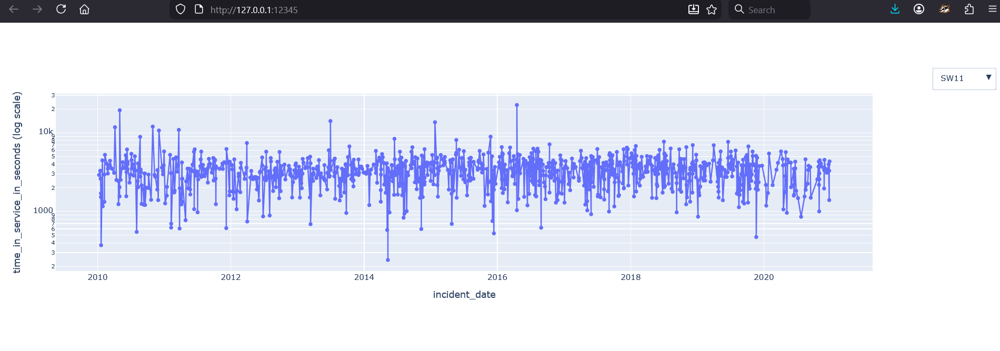

# Emergency Data Timeseries plots  

Foundational assumptions:  
* No cloud subscriptions required.  
* Run on relatively modern common endpoints (*no server required*).  
* Use a *popular* programming language to increase the probability of handing off this effort to others.  

#### Started with "Light timeseries plots"  

I started with a model by Fabio Arciniegas  
Original at: https://github.com/fabioarciniegas/light_timeseries_charts/tree/master  

Then I moved on to work with  [Seaborn](https://s3.amazonaws.com/assets.datacamp.com/blog_assets/Python_Seaborn_Cheat_Sheet.pdf).  

I could not get these to work in a user-friendly way for this research (*my skills were the limitation, not the software*).  

#### Moved on to Plotly and Dash  
After a *LONG* delay, I got back to this work and tried using [Plotly](https://plotly.com/python/) and [Dash](https://dash.plotly.com/tutorial?_gl=1*1jkxxvd*_gcl_au*Nzk5MjM3NjgxLjE3NzMyNTY5Nzg.*_ga*MTMzMDYyNjMzMi4xNzczMjU2OTc4*_ga_6G7EE0JNSC*czE3NzM0MjA1MzgkbzMkZzAkdDE3NzM0MjA1MzgkajYwJGwwJGgw).  

With a lot of bumbling the code in this repo is getting close to doing something useful.  

  


## Assembled for quick aggregation of Lincoln County, Nebraska Emergency Service Response Data  

Plot diagrams using time series data having the layout below:  

```csv

ToDo: insert the "real" data layout example here.  

```

The data used here is the output of code in another repository: [github.com/mccright/emerg-call-data-review](https://github.com/mccright/emerg-call-data-review).  
This data was assembled to consolidate some of the raw Lincoln County, Nebraska emergency service response data into simple time series plots.  

The input data is in a csv file.  The output is in a dynamic web app presenting plots by "response_unit."  The web app runs locally on a Windows PC, a Mac or a Linux endpoint.  

Data assumptions:  
* ```incident_date``` is the date of a given call for emergency service(s).  
* ```response_unit``` is the name of a given team.  
* ```response_time``` is the time from the initial call for service and the reply from a given response_unit.  
* ```time_in_service``` is the amount of time a given response_unit spent on that given service.  


